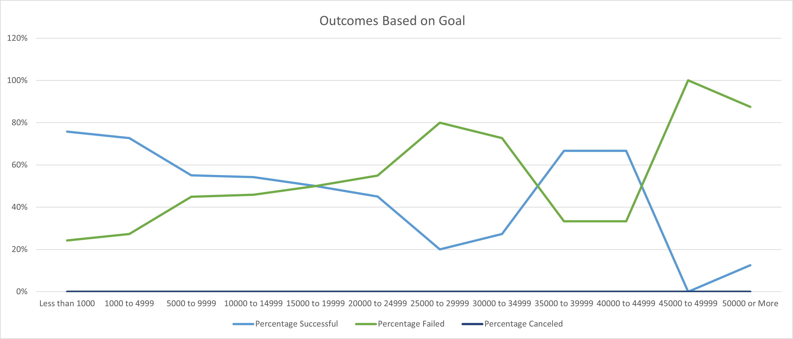
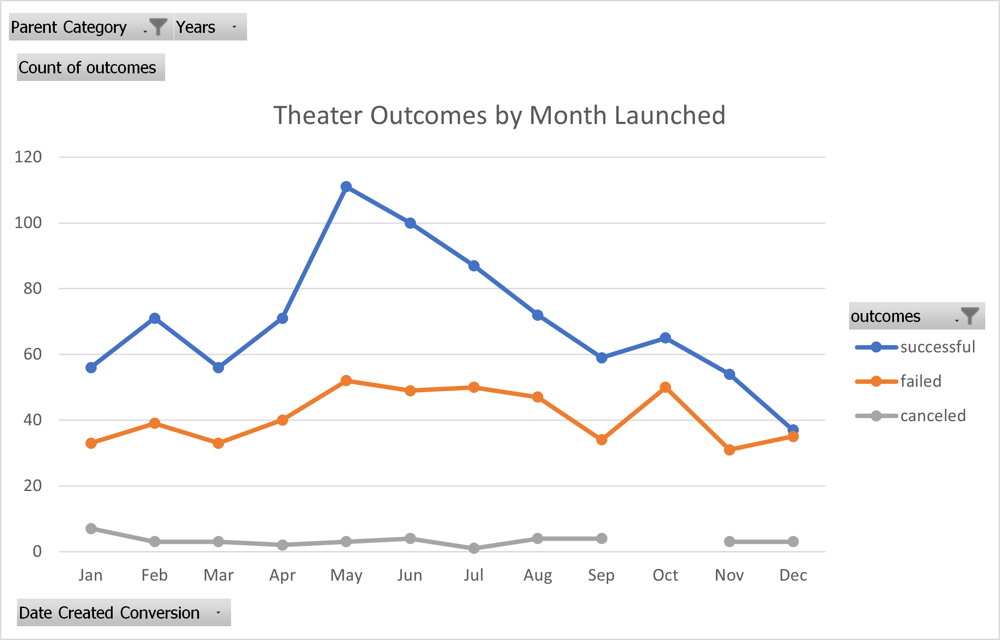

# An Analysis of Kickstarter Campaigns

## Overview of Project and Purpose

  This project entailed exploring a large data set in Excel, which was a comprehensive list of various Kickstarter campaign opportunities and their respective attributes and outcomes. The purpose was to familiarize oneself with combing through the data, sorting and filtering, using formulas, and creating visual representations which could then be presented to the client (Louise). The purpose of presenting the data to the client is for the client to be able to make a data driven decision on how to launch a successful kickstarter campaign.

## Analysis and Challenges

### Analysis of Outcomes Based on Goal Amount

  
  This line chart displays the percentage of successful, failed, and canceled Kickstarter Campaigns which were of subcategory 
'Plays' and their respective fundraising goal. Of note is that there are zero canceled plays, no matter the goal. It is apparent that there is a correlation between the success rate and goal amount of a campaign. The smaller the goal amount, the higher the percentage of successful campaigns. Since the smallest goal category is less than $1000, that is the category with the highest success rate (76%). The highest goal category is greater than $50,000 and it has the 2nd lowest success rate (13%). A limitation or challenge of this chart would be it does not display the number of campaigns involved in the percentage calculation and the possibility of an outlier data point skewing the overall analysis. There is no weight given to a goal range which has many campaigns vs a goal range which may only have 1 or a few campaigns. 

### Analysis of Outcomes Based on Launch Date 

This line chart with markers displays the outcome of Kickstarter Campaigns which were of parent category 'Theater' and their respective months in which they were launched. The number of campaigns which were canceled stayed fairly consistent (approx. <10) throughout every month of the year. It appears that the month has no effect on the number of canceled campaigns. The number of failed campaigns also showed minimal spread throughout the year, with the most being in May (52) and least being in November (31). Of most interest is the charting of the successful campaigns which showed a large jump in May (111) and a gradual decrease for the rest of the year to December (37). Despite May also having the highest number of failed campaigns (52), it is the best month to launch a campaign. 
  
  ### Challenges and Difficulties Encountered
  
  The first challenge came when taking an initial look at the data. There were two columns (I & J) in which the data was not readable. The data needed to be converted to a readable date format, which was done using a formula later provided. The next challenge came when calculating the average donation. Applying the formula to the entire column resulted numerous error messages, ie *#DIV/0!*. This error was then debugged and the IFERROR function corrected the issue. A few overall challenges to this analysis was the size of the data set and the existence of some outliers. The data set needed to be reduced to the subcategory 'Plays' for a more reasonable and relevant analysis. It is also included campaigns with fundraising goals which were extraordinarly high ($100,000,000). 

## Results

- What are two conclusions you can draw about the Outcomes based on Launch Date?
  1. The month of May is associated with the highest number of successful campaigns, followed by June. These would be the best two months to launch a campaign.  
  2. The month of the year has little to no effect on the number of canceled campaigns. 

- What can you conclude about the Outcomes based on Goals?

The smaller the goal amount, the higher the percentage of successful campaigns. One of the best ways to ensure a successful campaign would be to avoid setting a goal amount which is too high. For example, a goal of less than $5000 shows about a 76%-73% success rate as opposed to a goal of $5,000 - $14,999 with a 55%-54% success rate. 

- What are some limitations of this dataset?

A limitation of this data set would be the short amount of time in which it was collected (2009-2017). Being the current year is 2022, it would be important to have fresher, more recent, data to work with.  

  
- What are some other possible tables and/or graphs that we could create?
  
An analysis and visual representation of the length of kickstarter campaigns could be beneficial to gaining a better understanding of how to ensure a successful campaign. A possible correlation between the length of campaign (time between the launch date and deadline date) and it's success or failure would be crucial to know when determining how to give a campaign the best chance for success. A visual representation comparing the success/failure rates of similar campaigns in different countries would also be useful. 

