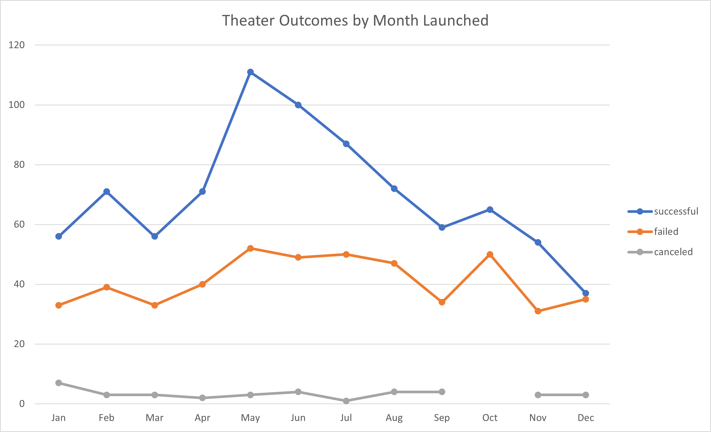

# An Analysis of Kickstarter Campaigns

## Overview of Project and Purpose

This project entailed exploring a large data set in Excel, which was a comprehensive list of various Kickstarter campaign opportunities and their respective attributes. The purpose was to familiarize oneself with combing through the data, sorting and filtering, using formulas, and creating visual representations which could then be presented to the client (Louise). The purpose of presenting the data to the client is for the client to be able to make a data driven decision on how to launch a successful kickstarter campaign.

## Analysis and Challenges

### Analysis of Outcomes Based on Goal Amount

This line chart displays the percentage of successful, failed, and canceled Kickstarter Campaigns which were of subcategory 
'Plays' and their respective fundraising goal. Of note is that there are zero canceled plays, no matter the goal. It is apparent that there is a correlation between the success rate and goal amount of a campaign. The smaller the goal amount, the higher the percentage of successful campaigns. Since the smallest goal category is <$1000, that is the category with the highest success rate (76%). The highest goal category is >$50,000 and it has the 2nd lowest success rate (13%). A limitation or challenge of this chart would be it does not display the number of campaigns involved in the percentage calculation and the possibiliy of an outlier data point skewing the overall analysis. There is no weight given to a goal range which has many campaigns vs a goal range which may only have 1 or a few campaigns. 

### Analysis of Outcomes Based on Launch Date 

fsfsdfds

### Challenges and Difficulties Encountered

## Results

- What are two conclusions you can draw about the Outcomes based on Launch Date?
  1. It is apparent that the month May is associated with the highest number of successful campaigns, followed by June. These would be the best two months to launch a campaign.  
  2. second conclusion

- What can you conclude about the Outcomes based on Goals?
  

- What are some limitations of this dataset?
    - Data collected from 2009-2017. 
    - The v
    - second limitation
  
- What are some other possible tables and/or graphs that we could create?
  
  An analysis and visual representation of the length of kickstarter campaigns could be beneficial to gaining a better understanding of how to ensure a successful campaign. A possible correlation between the length of campaign (time between the launch date and deadline date) and it's success or failure would be crucial to know when determining how to give a campaign the best chance for success. 

